# Parcial 1
### Autor: Juan López
&nbsp;

## Git
* Este proyecto es una versión del juego Nanogramo, lo realizó un amigo mío y se encuentra en un repositorio de GitHub. ([Nanogramo](https://github.com/edisonlunagutierrez/Nonograma))
* 
* Lo que se hizo fue crear una carpeta en el PC local, sobre la cual se clonó el repositorio con el siguiente comando: 
* 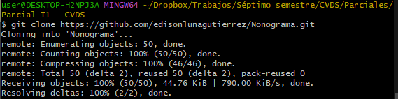
* Una vez clonado el repositorio de tal forma que esté guardado en una carpeta local, se crea este README junto con una carpeta con fotos para completar este archivo.
* Los añadimos con los comandos ```git add .```, y realizamos el primer commit con ```git commit -m "Se añade README y la carpeta de fotos."```.
* 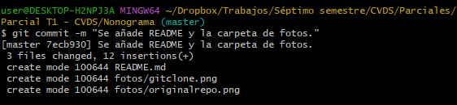
&nbsp;

## CraftsmanShip
* En esta sección vamos a ver si se implementan o no las buenas prácticas vistas en clase. Verificamos si los principios SOLID están siendo utilizados en el proyecto, los patrones GoF, etc.
&nbsp;
### SOLID:
* S (Single responsibility principle): 
    * El programa en general aplica bastante bien este principio, pues no hay ninguna clase que tenga más de una responsabilidad. Sin embargo, considero que en la clase InterfazApp su constructor debería estar más organizado. 
    * 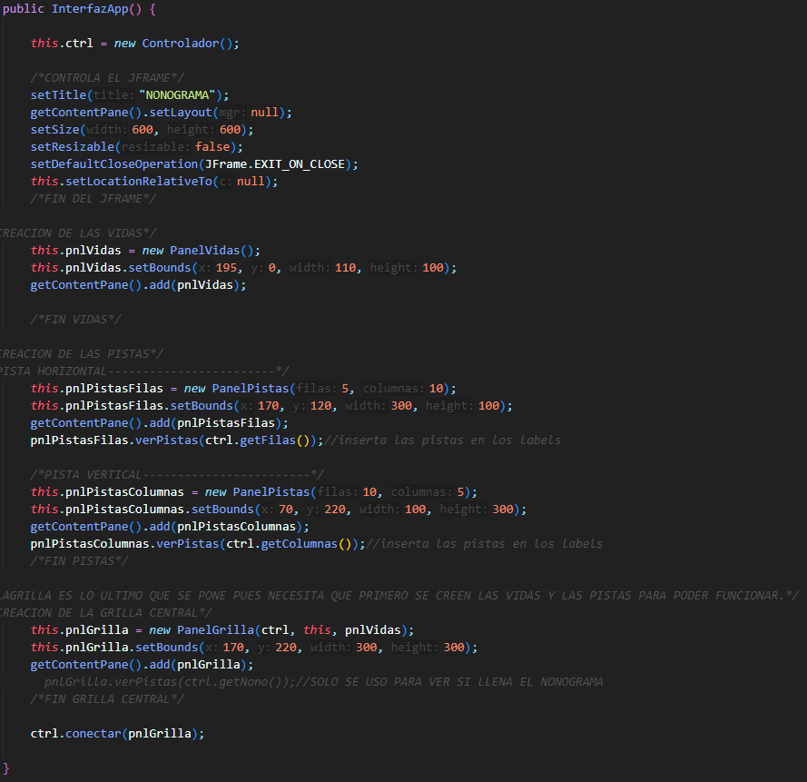
    * En este constructor se debería ejecutar un método distinto para cada parte de la interfaz. Uno para el PanelVidas, otro para cada PanelPistas y un último para el PanelGrilla.

* O (Open for extension, closed for modification principle):
    * Hay varios ejemplos de cómo no se aplica este principio en este proyecto, en otras palabras, varias instancias en la que no se toma en cuenta la posibilidad de extender a futuro este aplicativo. Uno de estos es el siguiente: 
    * 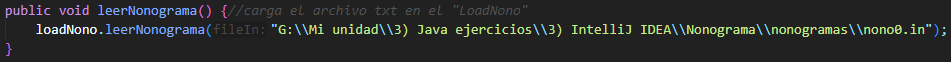
    * Aquí vemos que el programa tiene la función de leer partidas previas, sin embargo, está pensado solo para abrir un archivo específico guardado en un directorio local del PC del creador de la aplicación. 
    * Se debería crear la opción de que el usuario escoja el archivo a abrir desde el explorador de archivos.
    * También vemos en la clase PanelGrilla que está creada para tener un tamaño específico, sin embargo, si en el futuro se busca tener modos donde el tablero es más pequeño o más grande, tendríamos que modificar esta clase:
    * 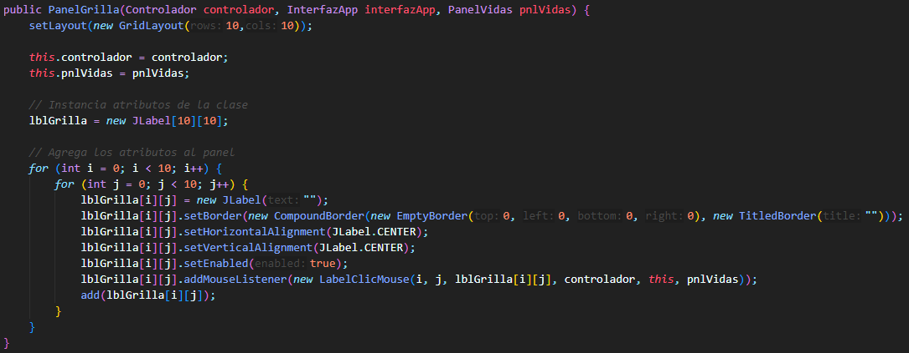
    * Para solucionar esto tendríamos que convertir esta clase en una clase padre y cambiar el tamaño a ser variable, para así, si llega la ocasión de necesitar tableros de tamaños distintos, hay que crear nuevas clases hijas de esta donde el tamaño cambia.

*  D (Dependency inversion):
    * En este proyecto tenemos ejemplos claros de cómo sí y, a su vez, no aplicar este principio apropiadamente. En primer lugar, tenemos nuevamente la clase PanelGrilla donde se usan los objetos como argumentos del constructor en lugar de crear nuevas instancias ahí, causando alto acoplamiento:
    * 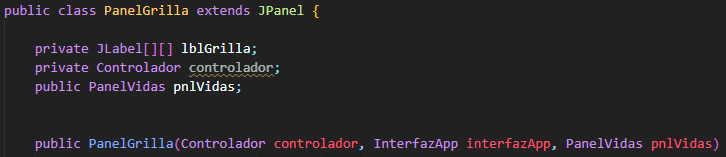
    * Y tenemos la clase Controlador en la que no se aplica este principio. Aquí se hace instancia de los objetos LoadNono y Nonograma dentro del constructor de la clase. 
    * 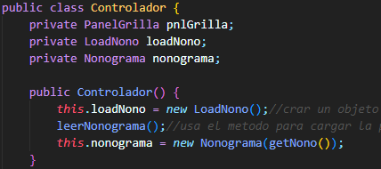
    * Para corregirlo hay que poner estos objetos como argumentos del constructor. 

### GoF Patterns:
* De creación:
    * Lo más parecido que tenemos a un patrón de creación en este proyecto es el funcionamiento de Controlador, el cual, hasta cierto punto, trabaja similar a como debe trabajar el patrón de creación Builder.
    * Para este ejemplo tenemos el producto (Nanogramo), tenemos el director (Controlador) y tenemos algo más o menos parecido a los constructores (LoadNono y Nonograma).
    * 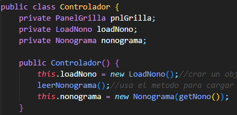
    * Lo que le falta a este proyecto para implementar correctamente el patrón Builder es tener una clase Builder como tal, es decir, una interfaz, cuyas clases hijas (builders concretos) son las que tengan los métodos para construir el producto como tal, en este caso, el Nanogramo.
&nbsp;

### Patrón de arquitectura:

* En este proyecto se maneja una estructura MVC (modelo/vista/controlador) la cual establece la distribución de las clases que hacen que este proyecto esté organizado de una forma apropiada.
* Capa modelo:
    * En este caso, el creador del proyecto llamó a esta capa como "mundo", lo cual debería ser cambiado solo con el propósito de que este sea más diciente y más fácil de leer. Debería llamarse "modelo".
    * En esta capa se encuentran las clases LoadNono y Nonograma, en las cuales se encuentra la lógica de la aplicación que es completamente independiente a la interfaz de usuario. 
    * 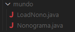
* Capa vista:
    * Aquí esta capa fue nombrada "interfaz", en la cual se debe encontrar todos los elementos visuales, parte de la GUI y nada más. Considero que el nombre debe cambiarse a "vista" para ser más diciente.
    * Esta capa presenta grandes errores, pues incluye elementos de lógica que podrían ser obviados de esta sección, así como elementos que pertenecen en el controlador. Por ejemplo, en la clase PanelGrilla encontramos el ActionListener para leer los inputs del mouse mientras se está jugando:
    * 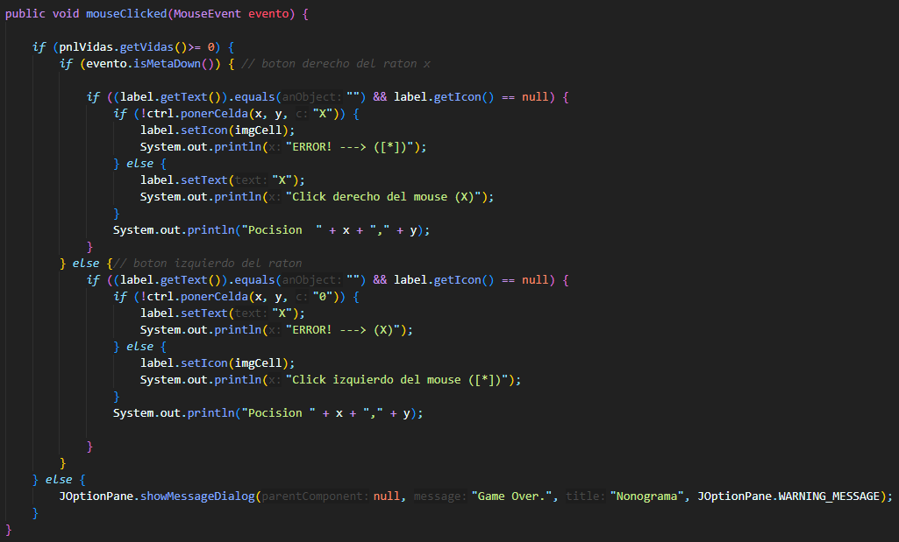
    * Para corregir esto se debería sacar este ActionListener y ser llevado a la clase Controlador.
* Capa controlador:
    * En esta capa se debe tener toda la lógica para recibir los inputs del usuario y traducir estos a acciones en la aplicación. 
    * En este proyecto esta capa está incorrecta, porque lo que se hace en su única clase (Controlador) es lógica que debería estar en la capa de modelo (o dominio). Pues lo que hace es tener un método para mostrar el mensaje de cuando el jugador gana el juego y para verificar que cuando se ingresa una entrada incorrecta el jugador pierda una vida.
    * 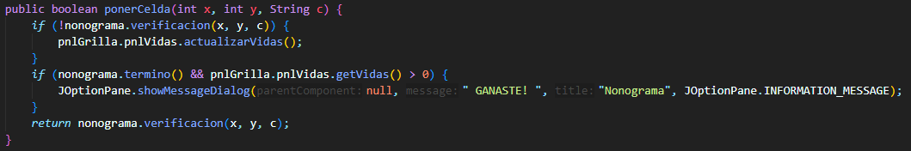
    * Toda esta clase debe ser enviada a la capa de modelo, y debería ponerse el ActionListener de la clase PanelGrilla, pues eso es lo que debería estar en esta capa.