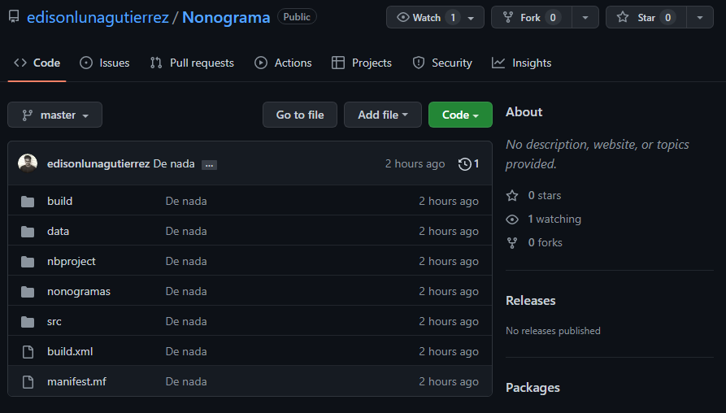

# Parcial 1
### Autor: Juan López


## Git
* Este proyecto lo realizó un amigo mío y se encuentra en un repositorio de GitHub. ([Nonograma](https://github.com/edisonlunagutierrez/Nonograma))

* Lo que se hizo fue crear una carpeta en el PC local, sobre la cual se clonó el repositorio con el siguiente comando: 

* Una vez clonado el repositorio de tal forma que esté guardado en una carpeta local, se crea este README junto con una carpeta con fotos para completar este archivo.
* Los añadimos con los comandos ```git add .```, y realizamos el primer commit con ```git commit -m "Se añade README y la carpeta de fotos.```.
